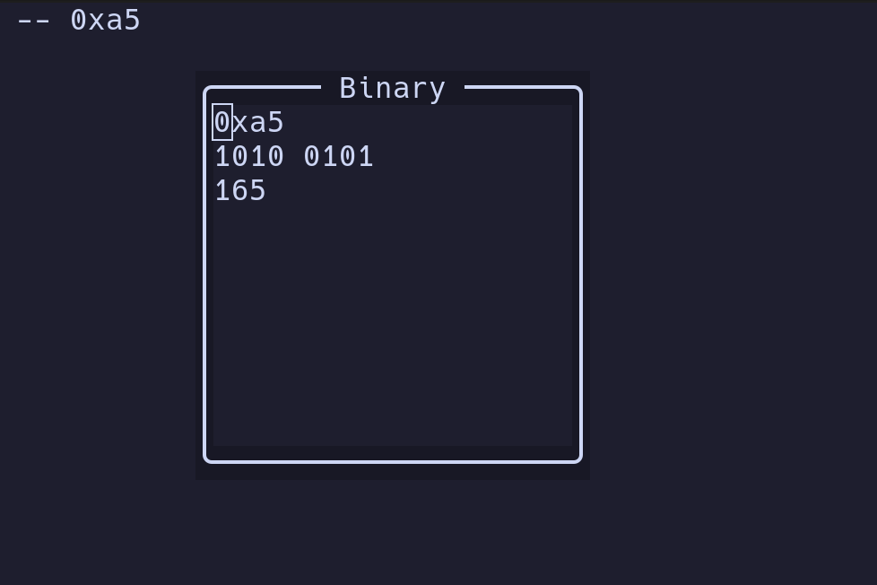

# binary-nvim

A plugin to show hex numbers in binary and decimal representation while in visual mode.

I found it very useful when working with C or VHDL.

Future conversions and manipulations are comming.



# lazy.vim

```lua
{
    "cegea/binary-nvim",
    config = function ()
        require('binary-nvim').setup()
    end
}
```

